# ESP32-CAM  Cube  使用說明書

**目錄**
<!-- TOC depthfrom:2 orderedlist:false -->

- [ESP32-CAM  Cube  使用說明書](#esp32-cam--cube--使用說明書)
  - [說明](#說明)
  - [ESP32-CAM 進行燒錄](#esp32-cam-進行燒錄)
    - [Step 1: 開啟裝置外殼](#step-1-開啟裝置外殼)
    - [Step 2: 取出 ESP32-CAM 進行燒錄](#step-2-取出-esp32-cam-進行燒錄)
    - [Step 3: 接上 USB to TTL 進行燒錄](#step-3-接上-usb-to-ttl-進行燒錄)
    - [Step 4:安裝 Thonny](#step-4安裝-thonny)
    - [Step 5:下載 ESP32-CAM 韌體 for MicroPython](#step-5下載-esp32-cam-韌體-for-micropython)
    - [Step 6: 使用 Thonny 燒錄韌體](#step-6-使用-thonny-燒錄韌體)
    - [Step 7: 裝回底座](#step-7-裝回底座)
  - [使用 ESP32-CAM 進行開發](#使用-esp32-cam-進行開發)

<!-- /TOC -->
## 說明
ESP32-CAM  Cube 教具主要是應用於『[AI + ESP32-CAM + AWS：物聯網與雲端運算的專題實作應用](https://www.books.com.tw/products/0011015162)』這本書籍的ESP32-CAM的應用。
 
ESP32-CAM Cube 教具内容清單包含以下物件：

編號 | 物品 | 個數 
---------|---------|----------
1 | 3D列印模組盒 | 1 
2 | ESP32-CAM | 1 
3 | ESP32-CAM LED | 1 
4 | Red LED 5mm 燈珠 | 1  
5 | 5V micro USB | 1  
6 | 5V 充放版(type C) | 1  
7 | ESP32-CAM MB 底座 | 1 
8 | 電源按鈕開關 | 1 
9 | 2000mAh鋰電池 | 1 
10 | CH340G USB 轉 TTL 模組 | 1 
11 | 數據傳輸線 100cm | 1 
12 | 紙盒包装 | 1  

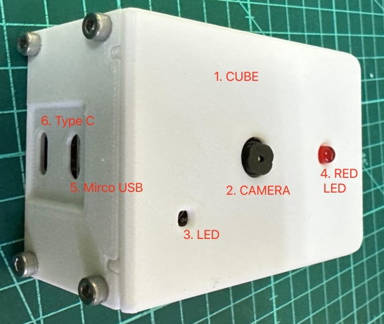  
ESP32-CAM Cube 教具正面

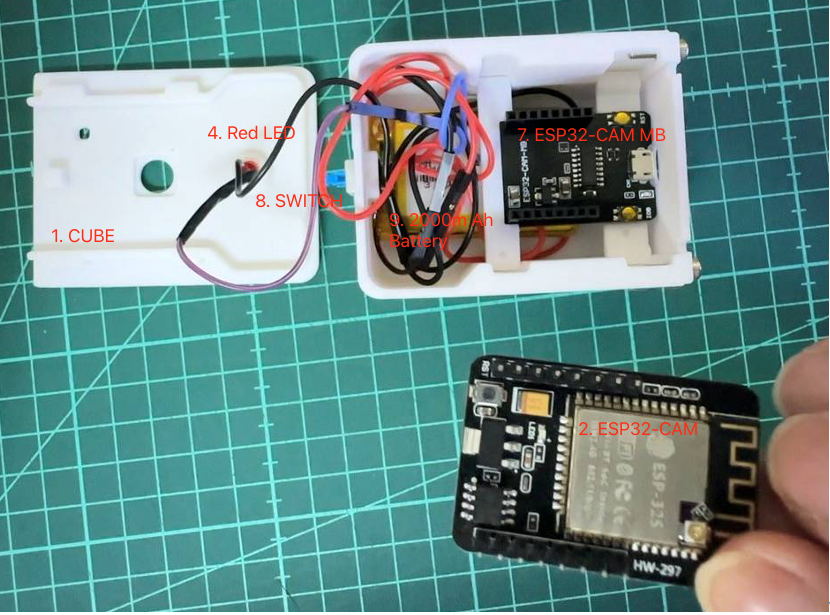  
ESP32-CAM Cube 教具內側

備註:
- 教具寄出前，皆會預先燒錄 MicroPython，並且測試（[測試程式](lab/website/frontend/esp32-cam/hardware_check.py)），讓使用者到手即可使用。
- 本教具以下皆稱為Cube。
- 連接埠每台電腦不同，挑選有USB Serial @ 開頭的(有可能不同請先確認連接埠)，本例為USB Serial @ COM3。
- [Cube 安裝影片](./images/cube_installation.mp4)

## ESP32-CAM 進行燒錄

1、開啟裝置外殼
2、取出 ESP32-CAM 進行燒錄
3、組裝
4、啟動裝置 

### Step 1: 開啟裝置外殼
Cube正上方有一處小凹陷，可由此打開上蓋。
 
 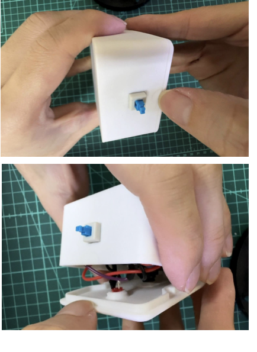
 
### Step 2: 取出 ESP32-CAM 進行燒錄
打開後可以看到 ESP32-CAM 模組與電池模組以及接線，將Cube放橫後抓好，如圖將ESP32-CAM 小心拔取出準備燒錄。

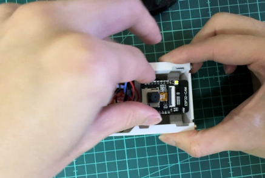

### Step 3: 接上 USB to TTL 進行燒錄

下表與下圖是說明 ESP32-CAM 模塊開發板與 CH340 序列埠模塊進行**下載模式**時的接線情形。

ESP32-CAM | CH340 序列埠模塊 | 說明 
---------|----------|----------
 5V | 5V | 需要注意 CH340 序列埠模塊的跳線 
 U0R | TXD | R是接收，T是傳送，需要一邊接一邊收 
 U0T | RXD | R是接收，T是傳送，需要一邊接一邊收 
 GND | GND | 地線    
 IO0 短路 GND | &nbsp; | ESP32-CAM 進入下載模式  

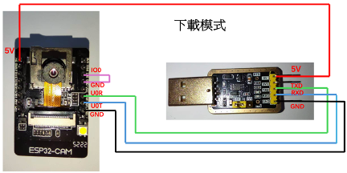  
ESP32-CAM 模塊開發板與 CH340 序列埠模塊進行下載模式的接線圖

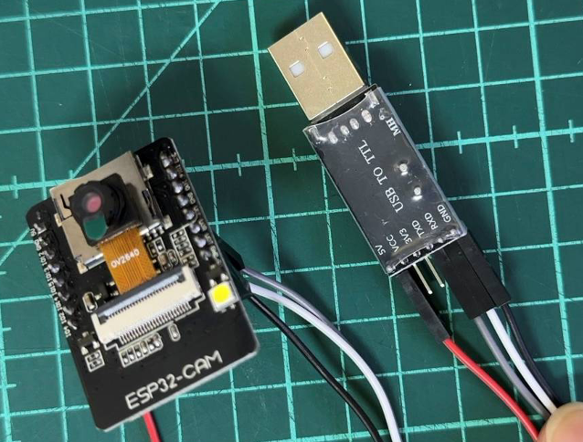  
實體圖

### Step 4:安裝 [Thonny](https://thonny.org/)

到 [Thonny](https://thonny.org/) 的官網 https://thonny.org/，根據自己的操作系統下載適合的版本

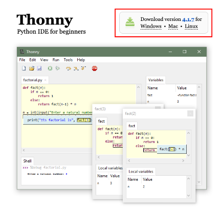  
根據自己的操作系統下載適合的 Thonny 版本

以下為 Windows 的安裝流程，下載 Windows 版的安裝文件 *thonny-4.0.2.exeg* ，請注意本身的 Windows 與硬體的版本，下載適合自己軟硬體環境的版本，網站會推薦適合的版本 (recommended for you)。

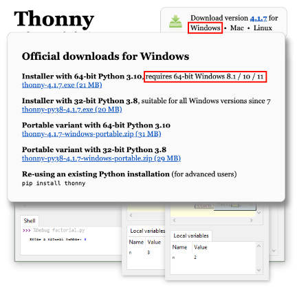  
下載 Windows 操作系統的 Thonny 版本

最好只安裝給自己使用，如下圖所示。

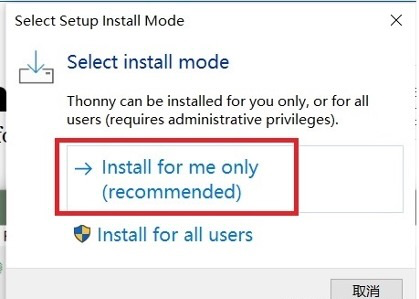  
安裝給自己使用

勾選在桌面建立圖標，這樣避免到時候找不到應用程式。

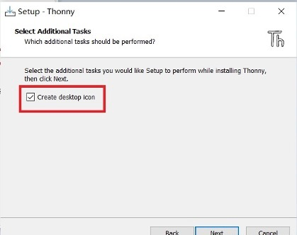  
建立桌面圖標

第一次啓用時會進行簡單的設定，如下所示，操作畫面則是上方視窗編輯程式區，下方視窗為顯示結果或是進行程式互動區。
語言(Language)： *繁體中文-TW*
初始設定(Initial settings)： *Standard*

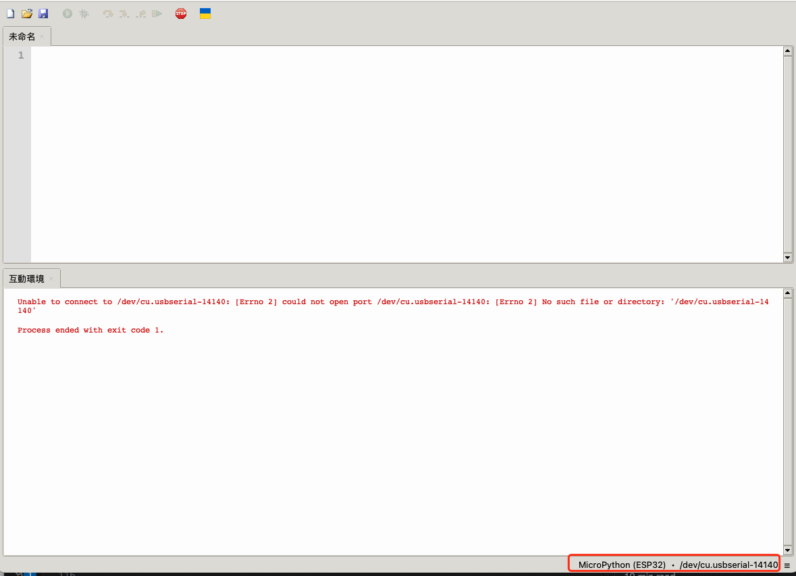  
Thonny 操作畫面

### Step 5:下載 ESP32-CAM 韌體 for MicroPython

進入 [shariltumin/esp32-cam-micropython-2022](https://github.com/shariltumin/esp32-cam-micropython-2022) github倉庫，選擇最新的韌體 **20230717**，如下圖所示。

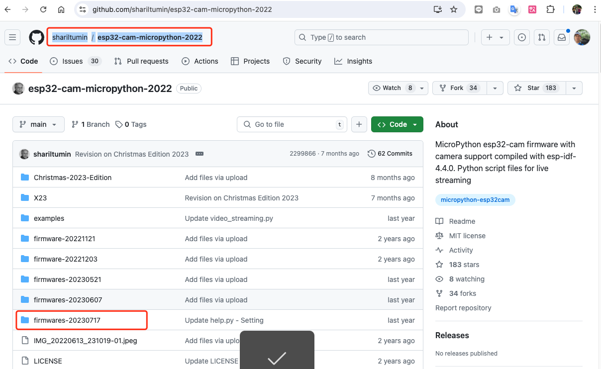  
選擇 firmwares-20230717

最後選擇的是 firmwares-20230717/ESP32/AI-Thinker-OV2640/WiFi-SSL 這個組態下的 firmware.bin

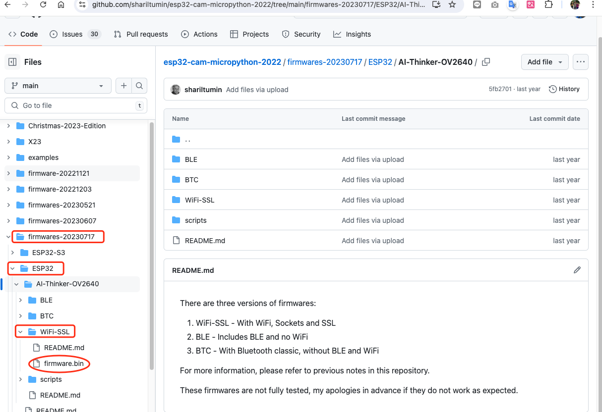  

### Step 6: 使用 Thonny 燒錄韌體
**使用 Thonny 設定直釋器**
打開 Thonny IDE，在點擊畫面狀態列的右下角，選擇*運行->設定直釋器*

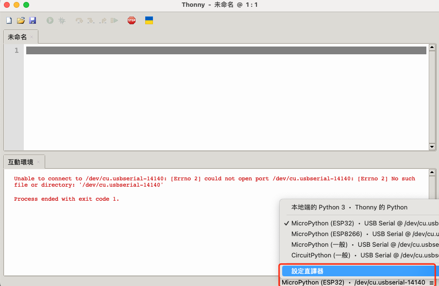  
在 Thonny IDE 中選擇運行->設定直釋器

在 Windows 作業系統中，連接埠選項會自動偵測到已經插入的 CH340 序列埠模塊，所以會顯示 *USB-SERIAL CH340 (COMX)*。

- 直釋器： *MicroPython(ESP32)*
- 連接埠或 WebREPL： *USB-SERIAL CH340 (COM3)*

最後點擊 **安裝或更新 MicroPython**

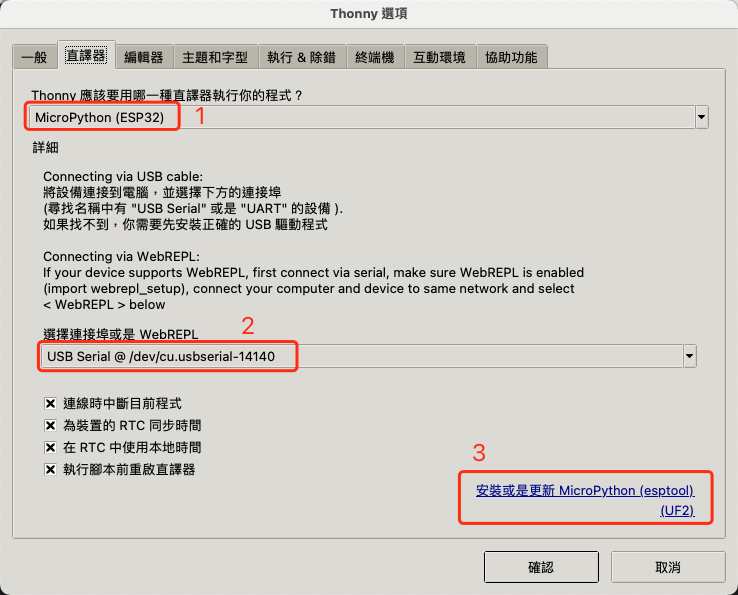  
設定直釋器到 ESP32-CAM

安裝並更新 MicroPython，指定連接埠(Port)跟燒錄檔韌體(Firmware)

1. 連接埠(Target Port)： *USB-SERIAL CH340 (COM3)*
   **勾選**先刪除後安裝 *(Erase flash before installing)*
2. 選擇從本地安裝，要選**安裝**按鈕左邊的選單，會出現一個選單，選第一個 _Select local MicroPython image ..._ 在本機找到從 [github](https://github.com/shariltumin/esp32-cam-micropython-2022/tree/main/firmwares-20230717/ESP32/AI-Thinker-OV2640/WiFi-SSL) 所下載的 ESP32-CAM 的韌體檔案 *esp32-cam-micropython-firmwares-20230717.bin*
3. 會根據本地檔案自動顯示，**請勿自行操作**

接著點擊**安裝**

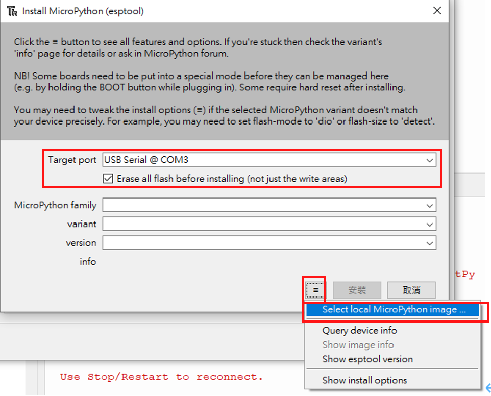  
安裝並更新 MicroPython

點擊**安裝**後要注意是否正常運作，正常運作畫面如下。

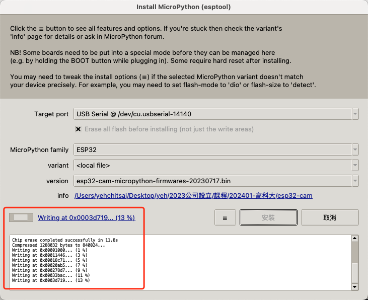  
安裝並更新 MicroPython 運行畫面

### Step 7: 裝回底座

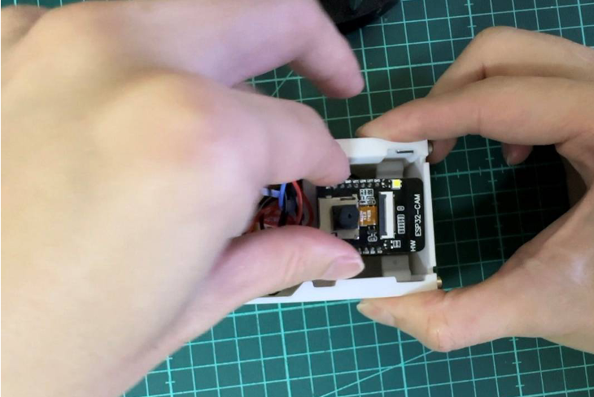  
燒錄完成後，將 ESP32-CAM 插回主機板插槽固定。

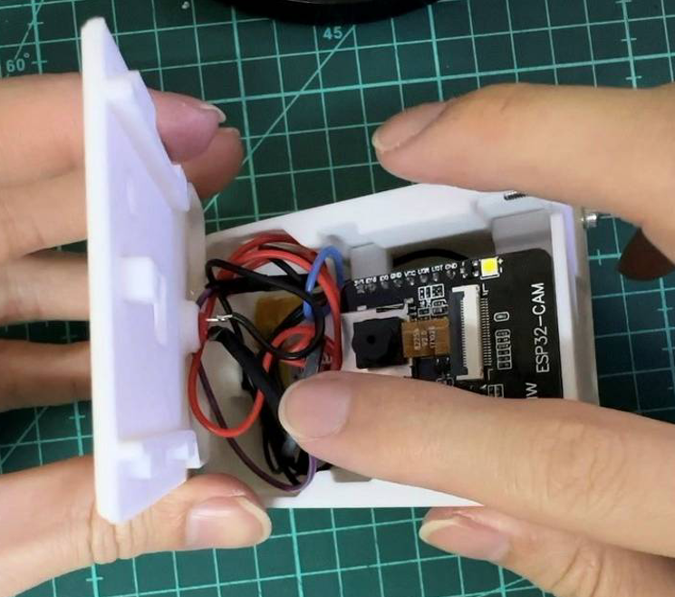  
準備蓋回上蓋時，先將線路簡單整理到上方空間
 
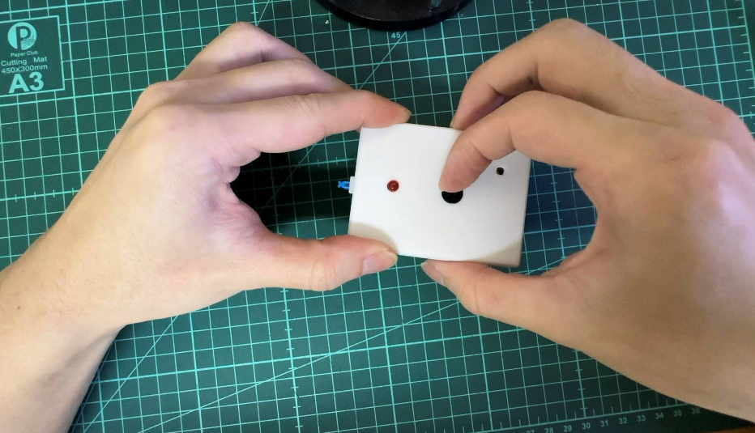  
再蓋上前，用手指確認鏡頭是否有有在正確開孔的位置、通常蓋上前會需要稍微摳一下，調整到正確位置後，再將上蓋完整蓋好。
 
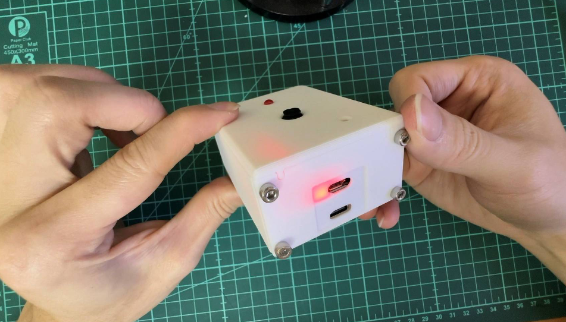  
安裝完成後，按下按鈕確認啟動。

## 使用 ESP32-CAM 進行開發

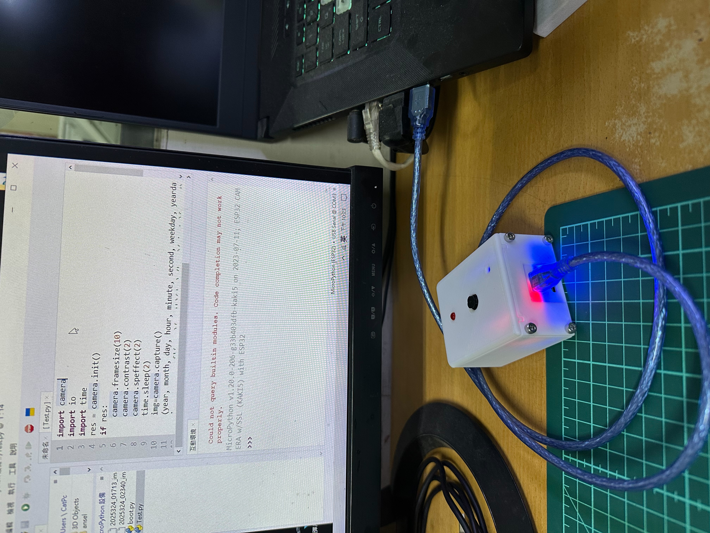  
連接資料傳輸線進行開發

使用資料傳輸線連接 cube 的 micro USB 接口，並打開電腦端的 Thonny 軟體，設定好右下角的連接埠，就可以開始進行 micropython 的程式開發，可以參考以下的一系列文章：
- [D09-使用 MicroPython 檔案存取 - io](https://ithelp.ithome.com.tw/articles/10344852)
- [D10-使用 MicroPython 控制燈號、撰寫 ISR - machine](https://ithelp.ithome.com.tw/articles/10344998)
- [D11-使用 MicroPython 連接 Wi-Fi、同步 NTP](https://ithelp.ithome.com.tw/articles/10345000)
- [D12-使用 MicroPython 安裝新模組與使用](https://ithelp.ithome.com.tw/articles/10345284)
- [D13-使用 MicroPython 拍照-ESP32-CAM](https://ithelp.ithome.com.tw/articles/10345443)
- [使用 socket 的網頁攝影機原始碼](./lab/website/frontend/esp32-cam/web_cam.py)
- [使用 microdot 的網頁攝影機原始碼](./lab/website/frontend/esp32-cam/web_camera_microdot.py)
- [檢查教材相關硬體程式原始碼](./lab/website/frontend/esp32-cam/hardware_check.py)

使用 [microdot](https://github.com/miguelgrinberg/microdot) 時要注意修改 microdot.py 原始碼第 8 行改為`import uasyncio as asyncio`

```python
...
# import asyncio
import uasyncio as asyncio
...
```
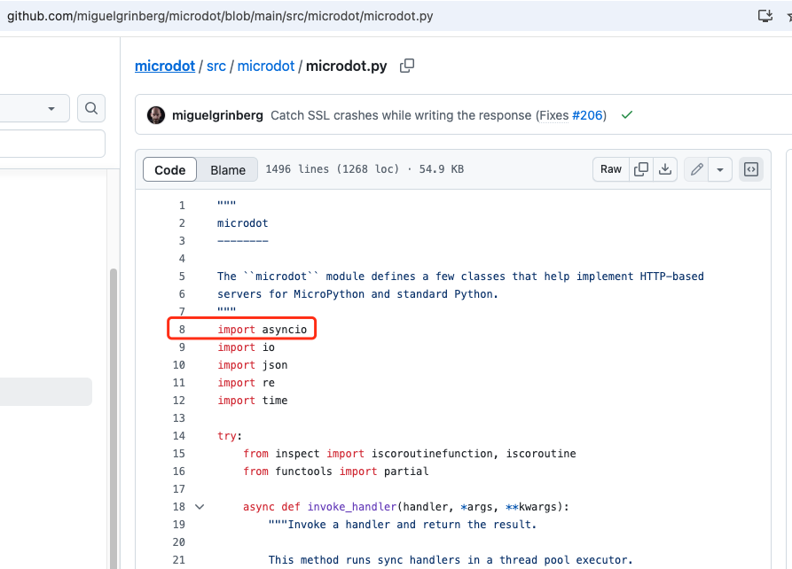  
microdot.py原始碼
