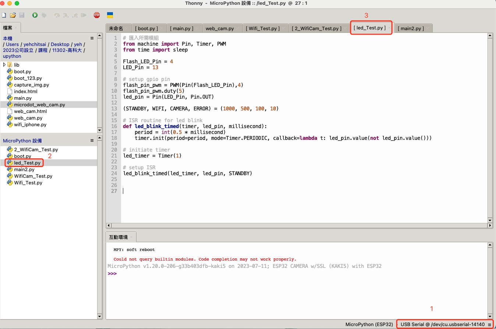
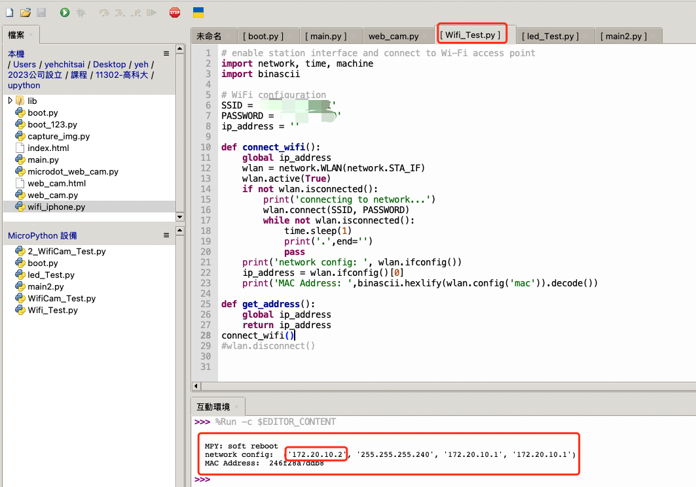
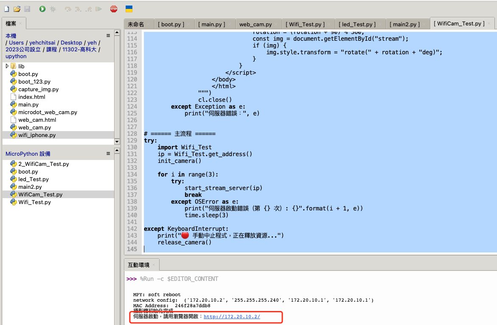
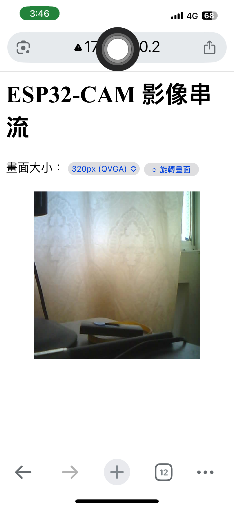
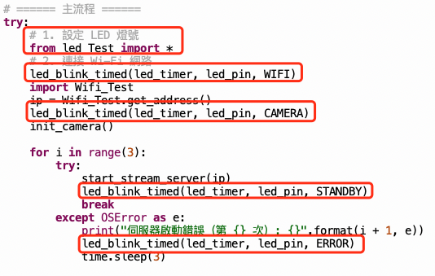
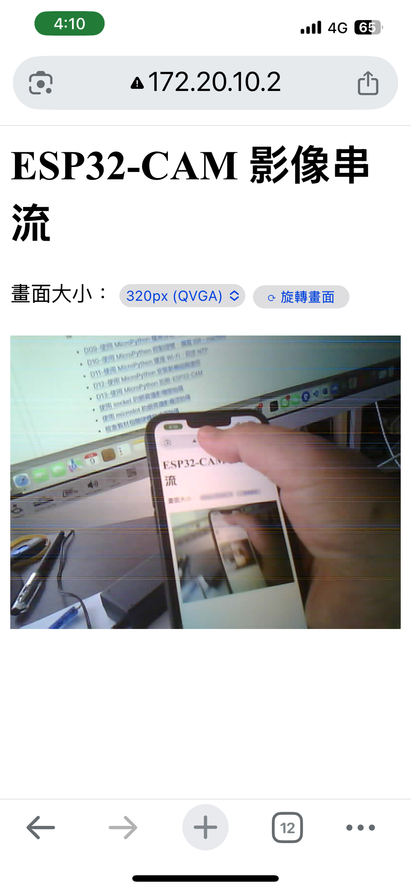
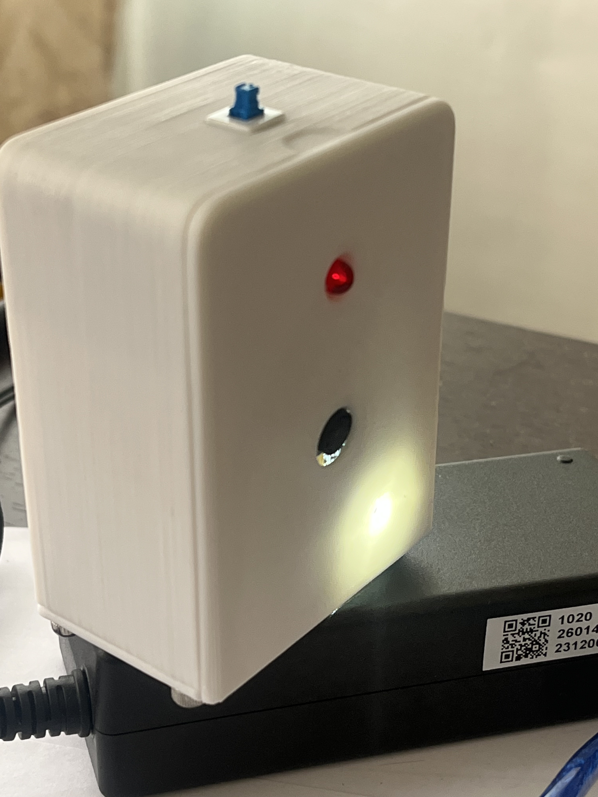

# 使用 CUBE 建立移動的網路攝影機
**目錄**
<!-- TOC depthfrom:2 orderedlist:false -->

- [說明](#%E8%AA%AA%E6%98%8E)
- [LED 測試](#led-%E6%B8%AC%E8%A9%A6)
- [Wi-Fi 連網測試](#wi-fi-%E9%80%A3%E7%B6%B2%E6%B8%AC%E8%A9%A6)
- [Web Camera 測試](#web-camera-%E6%B8%AC%E8%A9%A6)
- [設計為移動的 Web Camera](#%E8%A8%AD%E8%A8%88%E7%82%BA%E7%A7%BB%E5%8B%95%E7%9A%84-web-camera)

<!-- /TOC -->
## 說明
ESP32-CAM Cube 教具主要是應用於『AI + ESP32-CAM + AWS：物聯網與雲端運算的專題實作應用』這本書籍的 ESP32-CAM 的應用。教具内容清單包含以下物件：

編號 | 物品 | 個數
---|----|---
1 | 3D列印模組盒 | 1
2 | ESP32-CAM | 1
3 | ESP32-CAM LED | 1
4 | Red LED 5mm 燈珠 | 1
5 | 5V micro USB | 1
6 | 5V 充放版(type C) | 1
7 | ESP32-CAM MB 底座 | 1
8 | 電源按鈕開關 | 1
9 | 2000mAh鋰電池 | 1
10 | CH340G USB 轉 TTL 模組 | 1
11 | 數據傳輸線 100cm | 1
12 | 紙盒包装 | 1

詳細說明請參考以下網址 <https://github.com/yehchitsai/AIoTnAWSCloud/blob/main/ESP32-CAM-Cube.md>

以下將說明如何使用 ESP32-CAM Cube 教具來完成可攜帶的網路攝影機設計。

## LED 測試 
首先先測試 ESP32-CAM Cube 上的 LED 燈，這是用來指示網路攝影機的執行狀況，如果正常，就短閃，如果有狀況，就快閃。

_led_Test.py_
```python
# 匯入所需模組
from machine import Pin, Timer, PWM
from time import sleep

Flash_LED_Pin = 4
LED_Pin = 13

# setup gpio pin
flash_pin_pwm = PWM(Pin(Flash_LED_Pin),4)
flash_pin_pwm.duty(5)
led_pin = Pin(LED_Pin, Pin.OUT)

(STANDBY, WIFI, CAMERA, ERROR) = (1000, 500, 100, 10)

# ISR routine for led blink
def led_blink_timed(timer, led_pin, millisecond):
    period = int(0.5 * millisecond)
    timer.init(period=period, mode=Timer.PERIODIC, callback=lambda t: led_pin.value(not led_pin.value()))
    
# initiate timer
led_timer = Timer(1) 

# setup ISR
led_blink_timed(led_timer, led_pin, STANDBY)
```

1. 將 ESP32-CAM Cube 透過 usb 連接到電腦，相關連接方式 可參考 [ESP32-CAM Cube 使用說明書-使用 ESP32-CAM 進行開發](https://github.com/yehchitsai/AIoTnAWSCloud/blob/main/ESP32-CAM-Cube.md#%E4%BD%BF%E7%94%A8-esp32-cam-%E9%80%B2%E8%A1%8C%E9%96%8B%E7%99%BC) 
2. 在 MicroPython 設備中，新增上述檔案 _led_Test.py_  
3. 填入程式碼執行

執行結果是看到 ESP32-CAM 白色 LED燈已一秒四次的頻率閃爍， Red LED 5mm 燈珠 是以每秒2次的頻率閃爍。  


圖 1. 執行測試 LED 程式

## Wi-Fi 連網測試

測試 ESP32-CAM Cube 上的 Wi-Fi 連網功能。
記得將自己熱點名稱與密碼替換掉
* SSID = '自己熱點'
* PASSWORD = '熱點密碼'

_Wifi_Test.py_
```python
# enable station interface and connect to Wi-Fi access point
import network, time, machine
import binascii

# WiFi configuration
SSID = '自己熱點'
PASSWORD = '熱點密碼'
ip_address = ''

def connect_wifi():
    global ip_address
    wlan = network.WLAN(network.STA_IF)
    wlan.active(True)
    if not wlan.isconnected():
        print('connecting to network...')
        wlan.connect(SSID, PASSWORD)
        while not wlan.isconnected():
            time.sleep(1)
            print('.',end='')
            pass
    print('network config: ', wlan.ifconfig())
    ip_address = wlan.ifconfig()[0]
    print('MAC Address: ',binascii.hexlify(wlan.config('mac')).decode())

def get_address():
    global ip_address
    return ip_address
connect_wifi()
```

執行成功會在下方顯示 ESP32-CAM Cube 的ip，這個ip很重要，這個ip很重要，這個ip很重要，要記下來，作為網路攝影機的主機之用。


圖 2. 執行 Wi-Fi 連網測試程式

## Web Camera 測試
因為已經連線到網路熱點上，所以只要建立一個網路伺服器，並把攝影機的照片持續上傳就可以。

_WifiCamera_Test.py_
```python
import network
import time
import camera
import socket

# ====== 初始化攝影機 ======
def init_camera():
    try:
        camera.init()
        print("攝影機初始化完成")
    except Exception as e:
        print("攝影機初始化失敗:", e)

# ====== 釋放攝影機資源（手動中斷時用） ======
def release_camera():
    try:
        camera.deinit()
        print("攝影機資源已釋放")
    except:
        pass

# ====== 啟動 MJPEG 串流伺服器 ======
def start_stream_server(ip):
    #addr = socket.getaddrinfo(ip, 80)[0][-1]
    addr = ("", 80)
    s = socket.socket()
    s.setsockopt(socket.SOL_SOCKET, socket.SO_REUSEADDR, 1)
    s.bind(addr)
    s.listen(1)
    print("伺服器啟動，請用瀏覽器開啟：http://{}/".format(ip))

    while True:
        try:
            cl, addr = s.accept()
            cl.settimeout(10)
            print('客戶端連線：', addr)
            request = cl.recv(1024)

            if b'/stream' in request:
                cl.send(b"HTTP/1.1 200 OK\r\n")
                cl.send(b"Content-Type: multipart/x-mixed-replace; boundary=frame\r\n\r\n")
                try:
                    while True:
                        try:
                            buf = camera.capture()
                            if buf:
                                cl.send(b"--frame\r\n")
                                cl.send(b"Content-Type: image/jpeg\r\n\r\n")
                                cl.send(buf)
                                cl.send(b"\r\n")
                            time.sleep(0.1)
                        except Exception as e:
                            print("影像擷取失敗：", e)
                            break
                except Exception as e:
                    print("串流中斷：", e)
                finally:
                    cl.close()

            else:
                cl.send(b"HTTP/1.1 200 OK\r\nContent-Type: text/html\r\n\r\n")
                cl.send(b"""
                    <html>
                    <head>
                        <meta charset="UTF-8">
                        <meta name="viewport" content="width=device-width, initial-scale=1.0">
                        <title>ESP32-CAM 即時影像</title>
                        <style>
                            #img-container {
                                display: flex;
                                justify-content: center;
                                align-items: center;
                                max-width: 100%;
                                max-height: 80vh;
                                overflow: hidden;
                                margin-bottom: 20px;
                            }
                            #stream {
                                transition: transform 0.3s;
                                transform-origin: center center;
                                display: block;
                                max-width: 100%;
                                height: auto;
                            }
                        </style>
                    </head>
                    <body>
                        <h1>ESP32-CAM 影像串流</h1>

                        <label for="size">畫面大小：</label>
                        <select id="size" onchange="changeSize()">
                            <option value="320" selected>320px (QVGA)</option>
                            <option value="640">640px (VGA)</option>
                            <option value="800">800px (SVGA)</option>
                        </select>

                        <button onclick="rotateStream()">⟳ 旋轉畫面</button>

                        <br><br>
                        <div id="img-container">
                            
                        </div>

                        <script>
                            let rotation = 0;

                            function changeSize() {
                                let w = document.getElementById("size").value;
                                document.getElementById("stream").width = w;
                            }

                            function rotateStream() {
                                rotation = (rotation + 90) % 360;
                                const img = document.getElementById("stream");
                                if (img) {
                                    img.style.transform = "rotate(" + rotation + "deg)";
                                }
                            }
                        </script>
                    </body>
                    </html>
                """)
                cl.close()
        except Exception as e:
            print("伺服器錯誤：", e)

# ====== 主流程 ======
try:
    import Wifi_Test
    ip = Wifi_Test.get_address()
    init_camera()

    for i in range(3):
        try:
            start_stream_server(ip)
            break
        except OSError as e:
            print("伺服器啟動錯誤（第 {} 次）: {}".format(i + 1, e))
            time.sleep(3)

except KeyboardInterrupt:
    print("🔴 手動中止程式，正在釋放資源...")
    release_camera()
```


圖 3. 執行 Web Camera 測試程式

執行成功可以看到 Web Camera 伺服器的網址，只要在**相同熱點**的主機上輸入該網址，就可以看到網路攝影機的即時影片，因為我們都是用手機當熱點，所以可以直接在手機上打開瀏覽器，輸入主機位置即可觀看結果。


圖 4. 在手機上觀看 Web Camera 結果

## 設計為移動的 Web Camera 

在 MicroPython 對單晶片的設計中，只要將程式命名為 _main.py_ 就會在一通電的時候自動執行，所以我們只要將上述三個程式整合到 _main.py_ ，就可以將 ESP32-CAM Cube 變成式一個移動網路攝影機，因為 ESP32-CAM Cube 本身有整合一個 2000mAh鋰電池，所以可以自行供電。

1. 設定 LED 燈號
2. 連接 Wi-Fi 網路
3. 設定網路攝影機

修改 _WifiCamera_Test.py_ 部分程式碼，並另存為 _main.py_ 即可

_main.py_ 
```python
import network
import time
import camera
import socket

# ====== 初始化攝影機 ======
def init_camera():
    try:
        camera.init()
        print("攝影機初始化完成")
    except Exception as e:
        print("攝影機初始化失敗:", e)

# ====== 釋放攝影機資源（手動中斷時用） ======
def release_camera():
    try:
        camera.deinit()
        print("攝影機資源已釋放")
    except:
        pass

# ====== 啟動 MJPEG 串流伺服器 ======
def start_stream_server(ip):
    #addr = socket.getaddrinfo(ip, 80)[0][-1]
    addr = ("", 80)
    s = socket.socket()
    s.setsockopt(socket.SOL_SOCKET, socket.SO_REUSEADDR, 1)
    s.bind(addr)
    s.listen(1)
    print("伺服器啟動，請用瀏覽器開啟：http://{}/".format(ip))

    while True:
        try:
            cl, addr = s.accept()
            cl.settimeout(10)
            print('客戶端連線：', addr)
            request = cl.recv(1024)

            if b'/stream' in request:
                cl.send(b"HTTP/1.1 200 OK\r\n")
                cl.send(b"Content-Type: multipart/x-mixed-replace; boundary=frame\r\n\r\n")
                try:
                    while True:
                        try:
                            buf = camera.capture()
                            if buf:
                                cl.send(b"--frame\r\n")
                                cl.send(b"Content-Type: image/jpeg\r\n\r\n")
                                cl.send(buf)
                                cl.send(b"\r\n")
                            time.sleep(0.1)
                        except Exception as e:
                            print("影像擷取失敗：", e)
                            break
                except Exception as e:
                    print("串流中斷：", e)
                finally:
                    cl.close()

            else:
                cl.send(b"HTTP/1.1 200 OK\r\nContent-Type: text/html\r\n\r\n")
                cl.send(b"""
                    <html>
                    <head>
                        <meta charset="UTF-8">
                        <meta name="viewport" content="width=device-width, initial-scale=1.0">
                        <title>ESP32-CAM 即時影像</title>
                        <style>
                            #img-container {
                                display: flex;
                                justify-content: center;
                                align-items: center;
                                max-width: 100%;
                                max-height: 80vh;
                                overflow: hidden;
                                margin-bottom: 20px;
                            }
                            #stream {
                                transition: transform 0.3s;
                                transform-origin: center center;
                                display: block;
                                max-width: 100%;
                                height: auto;
                            }
                        </style>
                    </head>
                    <body>
                        <h1>ESP32-CAM 影像串流</h1>

                        <label for="size">畫面大小：</label>
                        <select id="size" onchange="changeSize()">
                            <option value="320" selected>320px (QVGA)</option>
                            <option value="640">640px (VGA)</option>
                            <option value="800">800px (SVGA)</option>
                        </select>

                        <button onclick="rotateStream()">⟳ 旋轉畫面</button>

                        <br><br>
                        <div id="img-container">
                            
                        </div>

                        <script>
                            let rotation = 0;

                            function changeSize() {
                                let w = document.getElementById("size").value;
                                document.getElementById("stream").width = w;
                            }

                            function rotateStream() {
                                rotation = (rotation + 90) % 360;
                                const img = document.getElementById("stream");
                                if (img) {
                                    img.style.transform = "rotate(" + rotation + "deg)";
                                }
                            }
                        </script>
                    </body>
                    </html>
                """)
                cl.close()
        except Exception as e:
            print("伺服器錯誤：", e)


# ====== 主流程 ======
try:
    # 1. 設定 LED 燈號
    #import led_Test
    from led_Test import *
    # 2. 連接 Wi-Fi 網路
    led_blink_timed(led_timer, led_pin, WIFI)
    import Wifi_Test
    ip = Wifi_Test.get_address()
    led_blink_timed(led_timer, led_pin, CAMERA)
    init_camera()

    for i in range(3):
        try:
            start_stream_server(ip)
            led_blink_timed(led_timer, led_pin, STANDBY)
            break
        except OSError as e:
            print("伺服器啟動錯誤（第 {} 次）: {}".format(i + 1, e))
            led_blink_timed(led_timer, led_pin, ERROR)
            time.sleep(3)

except KeyboardInterrupt:
    print("🔴 手動中止程式，正在釋放資源...")
    release_camera()
```
下圖顯示主要修改的部份，主要是修改燈號閃爍頻率，用來指示目前的狀態。


圖 5. 主要修改部分都是燈號顯示


圖 6. 移動的 ESP32-CAM Cube 用來拍攝手機畫面


圖 7. 移動的 ESP32-CAM Cube 執行時的外觀

