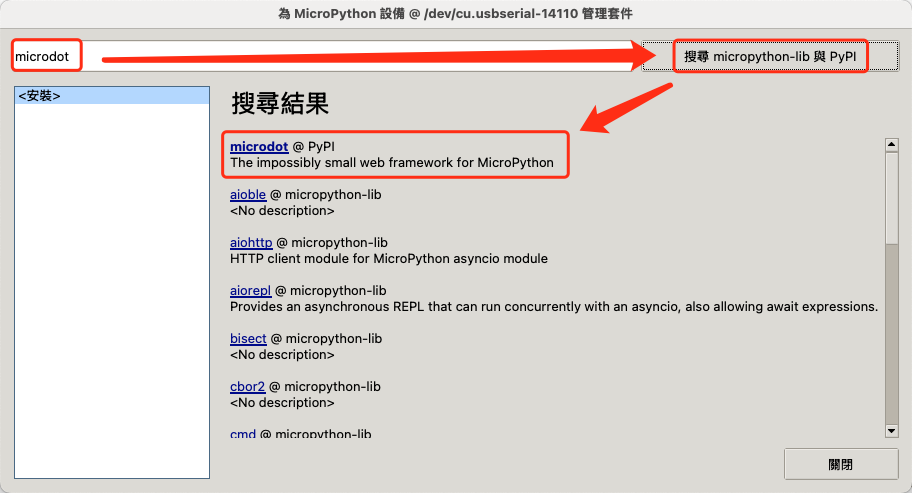
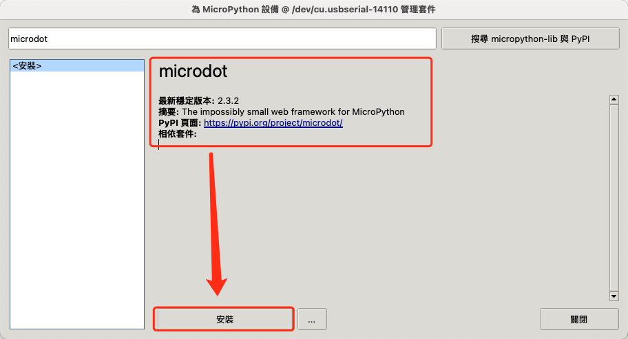
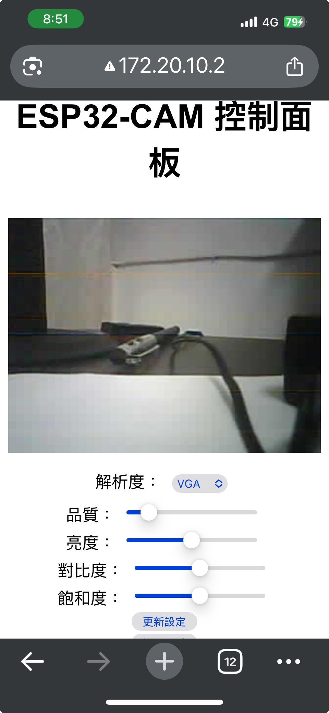
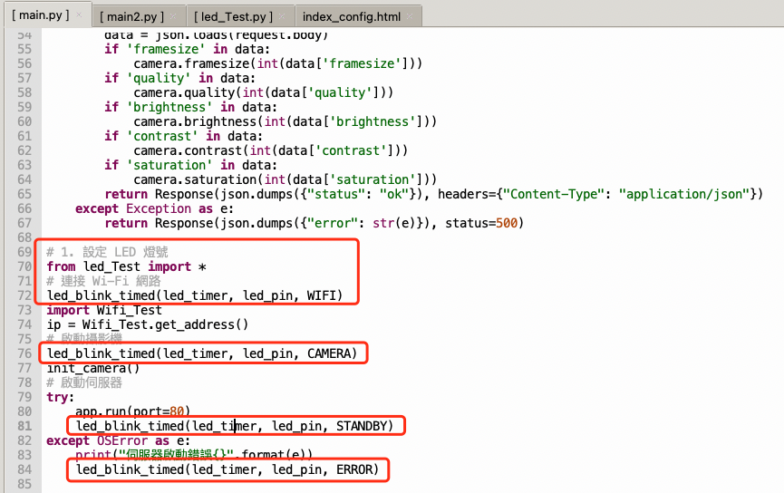

# 利用 CUBE 建立移動的網路攝影機-microdot
**目錄**
<!-- TOC depthfrom:2 orderedlist:false -->

- [利用 CUBE 建立移動的網路攝影機-microdot](#利用-cube-建立移動的網路攝影機-microdot)
  - [說明](#說明)
  - [LED 測試](#led-測試)
  - [Wi-Fi 連網測試](#wi-fi-連網測試)
  - [Web Camera 測試](#web-camera-測試)
    - [安裝 Microdot](#安裝-microdot)
    - [修改 Microdot](#修改-microdot)
    - [設定 Web Camera](#設定-web-camera)
  - [設計為移動的 Web Camera](#設計為移動的-web-camera)

<!-- /TOC -->
## 說明
ESP32-CAM Cube 教具主要是應用於『AI + ESP32-CAM + AWS：物聯網與雲端運算的專題實作應用』這本書籍的 ESP32-CAM 的應用。教具内容清單包含以下物件：

編號 | 物品 | 個數
---|----|---
1 | 3D列印模組盒 | 1
2 | ESP32-CAM | 1
3 | ESP32-CAM LED | 1
4 | Red LED 5mm 燈珠 | 1
5 | 5V micro USB | 1
6 | 5V 充放版(type C) | 1
7 | ESP32-CAM MB 底座 | 1
8 | 電源按鈕開關 | 1
9 | 2000mAh鋰電池 | 1
10 | CH340G USB 轉 TTL 模組 | 1
11 | 數據傳輸線 100cm | 1
12 | 紙盒包装 | 1

詳細說明請參考以下網址 <https://github.com/yehchitsai/AIoTnAWSCloud/blob/main/ESP32-CAM-Cube.md>

以下將說明如何使用 ESP32-CAM Cube 教具來完成可攜帶的網路攝影機設計。

## LED 測試 
首先先測試 ESP32-CAM Cube 上的 LED 燈，這是用來指示網路攝影機的執行狀況，如果正常，就短閃，如果有狀況，就快閃。

_led_Test.py_
```python
# 匯入所需模組
from machine import Pin, Timer, PWM
from time import sleep

Flash_LED_Pin = 4
LED_Pin = 13

# setup gpio pin
flash_pin_pwm = PWM(Pin(Flash_LED_Pin),4)
flash_pin_pwm.duty(5)
led_pin = Pin(LED_Pin, Pin.OUT)

(STANDBY, WIFI, CAMERA, ERROR) = (1000, 500, 100, 10)

# ISR routine for led blink
def led_blink_timed(timer, led_pin, millisecond):
    period = int(0.5 * millisecond)
    timer.init(period=period, mode=Timer.PERIODIC, callback=lambda t: led_pin.value(not led_pin.value()))
    
# initiate timer
led_timer = Timer(1) 

# setup ISR
led_blink_timed(led_timer, led_pin, STANDBY)
```

1. 將 ESP32-CAM Cube 透過 usb 連接到電腦，相關連接方式 可參考 [ESP32-CAM Cube 使用說明書-使用 ESP32-CAM 進行開發](https://github.com/yehchitsai/AIoTnAWSCloud/blob/main/ESP32-CAM-Cube.md#%E4%BD%BF%E7%94%A8-esp32-cam-%E9%80%B2%E8%A1%8C%E9%96%8B%E7%99%BC) 
2. 在 MicroPython 設備中，新增上述檔案 _led_Test.py_  
3. 填入程式碼執行

執行結果是看到 ESP32-CAM 白色 LED燈已一秒四次的頻率閃爍， Red LED 5mm 燈珠 是以每秒2次的頻率閃爍。  


圖 1. 執行測試 LED 程式

## Wi-Fi 連網測試

測試 ESP32-CAM Cube 上的 Wi-Fi 連網功能。
記得將自己熱點名稱與密碼替換掉
* SSID = '自己熱點'
* PASSWORD = '熱點密碼'

_Wifi_Test.py_
```python
# enable station interface and connect to Wi-Fi access point
import network, time, machine
import binascii

# WiFi configuration
SSID = '自己熱點'
PASSWORD = '熱點密碼'
ip_address = ''

def connect_wifi():
    global ip_address
    wlan = network.WLAN(network.STA_IF)
    wlan.active(True)
    if not wlan.isconnected():
        print('connecting to network...')
        wlan.connect(SSID, PASSWORD)
        while not wlan.isconnected():
            time.sleep(1)
            print('.',end='')
            pass
    print('network config: ', wlan.ifconfig())
    ip_address = wlan.ifconfig()[0]
    print('MAC Address: ',binascii.hexlify(wlan.config('mac')).decode())

def get_address():
    global ip_address
    return ip_address
connect_wifi()
```

執行成功會在下方顯示 ESP32-CAM Cube 的ip，這個ip很重要，這個ip很重要，這個ip很重要，要記下來，作為網路攝影機的主機之用。


圖 2. 執行 Wi-Fi 連網測試程式

## Web Camera 測試 
因為已經連線到網路熱點上，所以只要建立一個網路伺服器，並把攝影機的照片持續上傳就可以。
Microdot 是一個受 Flask 啟發的簡約 Python Web 框架。由於體積小，它可以在微控制器等資源有限的系統上運作。標準 Python（CPython）和 MicroPython 均支援。
在 MicroPython 中使用 [microdot](https://github.com/miguelgrinberg/microdot) 時要注意修改 microdot.py 原始碼第 8 行改為`import uasyncio as asyncio`
### 安裝 Microdot

在 Thonny 中安裝套件可以參考這篇文章[D12-使用 MicroPython 安裝新模組與使用](https://ithelp.ithome.com.tw/articles/10345284)，畫面如下。


圖 3. 搜尋 Microdot 套件

可以發現 microdot 套件是來自 PyPI 而非 micropython-lib ，表示它並未提供 micropython 版本。


圖 4. 安裝 Microdot 套件

注意安裝版本2.3.2，有可能因為版本不同而無法執行
### 修改 Microdot
在 MicroPython 中使用 [microdot](https://github.com/miguelgrinberg/microdot) 時要注意修改 microdot.py 原始碼第 8 行改為`import uasyncio as asyncio`

```python
...
# import asyncio
import uasyncio as asyncio
...
```
修改 ESP32-CAM Cube 中的 microdot.py 原始碼

  
microdot.py原始碼
### 設定 Web Camera

主要就是完成以下操作，使用 microdot 最大好處就是可以將網頁隔離出來

* 連接 Wi-Fi 網路
* 啟動攝影機
* 啟動伺服器

_web_cam.py_
```python
from microdot import Microdot, Response, send_file
import json
import camera
import time
import sys

# 設定 Response 類型，讓它支援二進制數據
Response.default_content_type = 'text/html'

# ====== 初始化攝影機 ======
def init_camera():
    try:
        camera_status = camera.init()
        if camera_status:
            camera.framesize(7)# 解析度
            camera.quality(50)
            camera.speffect(0)
            print("攝影機初始化完成")
        else:
            print('ternimate program')
            release_camera()
            sys.exit(1)
    except Exception as e:
        print("攝影機初始化失敗:", e)
        sys.exit(1)

# ====== 釋放攝影機資源（手動中斷時用） ======
def release_camera():
    try:
        camera.deinit()
        print("攝影機資源已釋放")
    except:
        pass


# 啟動 `microdot` 伺服器
app = Microdot()

# 提供主頁
@app.route('/')
def index(request):
    return send_file('/index.html')

# 提供即時影像
@app.route('/capture')
def capture(request):
    img = camera.capture()
    return Response(img, headers = {"Content-Type": "image/jpeg"})

# 設定攝影機參數
@app.route('/config', methods=['POST'])
def config(request):
    try:
        data = json.loads(request.body)
        if 'framesize' in data:
            camera.framesize(int(data['framesize']))
        if 'quality' in data:
            camera.quality(int(data['quality']))
        if 'brightness' in data:
            camera.brightness(int(data['brightness']))
        if 'contrast' in data:
            camera.contrast(int(data['contrast']))
        if 'saturation' in data:
            camera.saturation(int(data['saturation']))
        return Response(json.dumps({"status": "ok"}), headers={"Content-Type": "application/json"})
    except Exception as e:
        return Response(json.dumps({"error": str(e)}), status=500)

# 連接 Wi-Fi 網路
import Wifi_Test
ip = Wifi_Test.get_address()
# 啟動攝影機
init_camera()
# 啟動伺服器
try:
    app.run(port=80)
except OSError as e:
    print("伺服器啟動錯誤{}".format(e))
```

Web Camera 的網頁，提供以下功能
- 可以觀看即時影像
- 設定解析度、畫質、亮度、飽和度等
- 可以保存圖片

_index.html_
```html
<!DOCTYPE html>
<html lang="zh-TW">
<head>
    <meta charset="UTF-8">
    <meta name="viewport" content="width=device-width, initial-scale=1.0">
    <title>ESP32-CAM 控制面板</title>
    <style>
        body { text-align: center; font-family: Arial, sans-serif; }
        img { width: 100%; max-width: 640px; margin-top: 10px; }
        .control-panel { margin: 10px; }
        select, input { margin: 5px; }
    </style>
</head>
<body>
    <h1>ESP32-CAM 控制面板</h1>
    

    <div class="control-panel">
        <label>解析度：</label>
        <select id="framesize">
            <option value="10">UXGA</option>
            <option value="9">SXGA</option>
            <option value="8">XGA</option>
            <option value="7">SVGA</option>
            <option value="6">VGA</option>
            <option value="5" selected>QVGA</option>
        </select><br/>

        <label>品質：</label>
        <input type="range" id="quality" min="10" max="63" value="10"><br/>

        <label>亮度：</label>
        <input type="range" id="brightness" min="-2" max="2" value="0"><br/>

        <label>對比度：</label>
        <input type="range" id="contrast" min="-2" max="2" value="0"><br/>

        <label>飽和度：</label>
        <input type="range" id="saturation" min="-2" max="2" value="0"><br/>

        <button onclick="updateSettings()">更新設定</button><br/>
        <button onclick="capture()">擷取圖片</button>        
    </div>

    <script>
        function capture() {
            var link = document.createElement('a');
            link.href = '/capture';
            link.download = 'esp32_image.jpg';
            document.body.appendChild(link);
            link.click();
            document.body.removeChild(link);
        }    
        function updateSettings() {
            const settings = {
                framesize: document.getElementById('framesize').value,
                quality: document.getElementById('quality').value,
                brightness: document.getElementById('brightness').value,
                contrast: document.getElementById('contrast').value,
                saturation: document.getElementById('saturation').value
            };

            fetch('/config', {
                method: 'POST',
                headers: { 'Content-Type': 'application/json' },
                body: JSON.stringify(settings)
            }).then(response => response.json())
              .then(data => console.log(data));
        }

        // 每 0.5 秒更新影像
        setInterval(() => {
            document.getElementById('camera_feed').src = "/capture?" + new Date().getTime();
        }, 500);
    </script>
</body>
</html>

```



圖 3. 執行 Web Camera 測試程式

執行成功可以看到 Web Camera 伺服器的網址，只要在**相同熱點**的主機上輸入該網址，就可以看到網路攝影機的即時影片，因為我們都是用手機當熱點，所以可以直接在手機上打開瀏覽器，輸入主機位置即可觀看結果。

## 設計為移動的 Web Camera 

在 MicroPython 對單晶片的設計中，只要將程式命名為 _main.py_ 就會在一通電的時候自動執行，所以我們只要將上述三個程式整合到 _main.py_ ，就可以將 ESP32-CAM Cube 變成式一個移動網路攝影機，因為 ESP32-CAM Cube 本身有整合一個 2000mAh鋰電池，所以可以自行供電。

1. 設定 LED 燈號
2. 連接 Wi-Fi 網路
3. 設定網路攝影機

修改 _web_cam.py_ 部分程式碼，並另存為 _main.py_ 即可

_main.py_ 
```python
from microdot import Microdot, Response, send_file
import json
import camera
import time
import sys

# 設定 Response 類型，讓它支援二進制數據
Response.default_content_type = 'text/html'

# ====== 初始化攝影機 ======
def init_camera():
    try:
        camera_status = camera.init()
        if camera_status:
            camera.framesize(7)# 解析度
            camera.quality(50)
            camera.speffect(0)
            print("攝影機初始化完成")
        else:
            print('ternimate program')
            release_camera()
            sys.exit(1)
    except Exception as e:
        print("攝影機初始化失敗:", e)
        sys.exit(1)

# ====== 釋放攝影機資源（手動中斷時用） ======
def release_camera():
    try:
        camera.deinit()
        print("攝影機資源已釋放")
    except:
        pass


# 啟動 `microdot` 伺服器
app = Microdot()

# 提供主頁
@app.route('/')
def index(request):
    return send_file('/index.html')

# 提供即時影像
@app.route('/capture')
def capture(request):
    img = camera.capture()
    return Response(img, headers = {"Content-Type": "image/jpeg"})

# 設定攝影機參數
@app.route('/config', methods=['POST'])
def config(request):
    try:
        data = json.loads(request.body)
        if 'framesize' in data:
            camera.framesize(int(data['framesize']))
        if 'quality' in data:
            camera.quality(int(data['quality']))
        if 'brightness' in data:
            camera.brightness(int(data['brightness']))
        if 'contrast' in data:
            camera.contrast(int(data['contrast']))
        if 'saturation' in data:
            camera.saturation(int(data['saturation']))
        return Response(json.dumps({"status": "ok"}), headers={"Content-Type": "application/json"})
    except Exception as e:
        return Response(json.dumps({"error": str(e)}), status=500)

# 1. 設定 LED 燈號
from led_Test import *
# 連接 Wi-Fi 網路
led_blink_timed(led_timer, led_pin, WIFI)
import Wifi_Test
ip = Wifi_Test.get_address()
# 啟動攝影機
led_blink_timed(led_timer, led_pin, CAMERA)
init_camera()
# 啟動伺服器
try:
    app.run(port=80)
    led_blink_timed(led_timer, led_pin, STANDBY)
except OSError as e:
    print("伺服器啟動錯誤{}".format(e))
    led_blink_timed(led_timer, led_pin, ERROR)
```
下圖顯示主要修改的部份，主要是修改燈號閃爍頻率，用來指示目前的狀態。


圖 5. 主要修改部分都是燈號顯示


圖 6. 移動的 ESP32-CAM Cube 執行時的外觀

